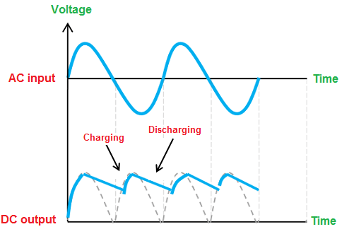

# Fonte-tensaoAjustavel
Trabalho 1 da matéria "SSC0180 Eletronica para Computacao", criação de uma fonte com tensão ajustável

## Especificações
O trabalho exige que os alunos montem um circuito eletrônico que recebe na entrada uma tensão alta e alternada, mais especificante de uma tomada, o que no brasil consiste de 127V e 60Hz. O circuito deve converter isso para uma tensão menor e contínua.

Além disso, é necessário utilizar um potênciometro de forma que seja possível ajustar a tensão, sendo o máximo de aproximadamente 12V e o mínimo 3V.

## Componentes
Para montar o circuito em questão, foram utilizados os seguintes componentes:

| Quantidade | Componente               | Valor R$            | Função                                                                    |
| ---------- | ------------------------ | ------------------- | ------------------------------------------------------------------------- |
| 1          | Transformador            | Em torno de R$50,00 | Reduzir a tensão                                                          |
| 1          | Ponte de Diodo           | R$3,90              | Converte a parte negativo do sinal senoidal para positiva (ou vice-versa) |
| 1          | Capacitor elco - 1000µF  | R$2,00              | Armazena carga que pode ser liberada posteriormente                       |
| 1          | LED 5mm Vermelho         | R$0,50              | Brilha quando recebe energia                                              |
| 1          | Diodo Zenner 13V         | R$0,50              | Funciona como um diodo, porém com uma corrente pequena máxima pequena     |
| 1          | Potenciômetro - 10kΩ, 1W | R$7,00              | Exerce uma resistência variável que é controlada por um botão giratório   |
| 1          | Resistor 3kΩ - Carvão    | R$0,07              | Possui resistência determinada                                            |
| 1          | Resistor 2.2kΩ - Carvão  | R$0,07              | Possui resistência determinada                                            |
| 1          | Resistor 3.3kΩ - Carvão  | R$0,07              | Possui resistência determinada                                            |
| 1          | Resistor 510Ω - Carvão   | R$0,07              | Possui resistência determinada                                            |
| 1          | Resistor 100Ω - Metal    | R$1,90              | Possui resistência determinada                                            |
| 1          | Resistor 120Ω - Metal    | R$1,90              | Possui resistência determinada                                            |
| 1          | Transistor 2N2222A NPN   | R$2,60              | Amplifica e seleciona se um sinal passa por ele ou não                    |
| 1          | Protoboard 400 furos     | R$21,70             | Possui ligações que permite que a conexão entre os componentes            |
| 5          | Jumper Macho-Macho       | R$0,70              | Liga dois pontos da protoboard                                            |
| **Total**  | R$95,78                  |

Observações: 
- O transformador foi fornecido pelo professor, porém é possível utilizar o transformador de qualquer eletrônico antigo, bastando ajustar as resistências para a razão do transformador em questão.
- Para reduzir custos poderiam ser utilizados 4 diodos no lugar da ponte, porém foi escolhido não fazer isso pois como o circuito foi montado em uma protoboard as conexões não são perfeitas, assim muitas conexões podem aumentar a resistência interna do circuito, fazendo com os resistores tivessem que ser ajustados e causando possíveis problemas no circuito por conexões mal feitas.
- Novamente para reduzir custos e melhorar a aparência do circuito alguns jumpers foram substituídos por pequenos fios de metal (recortados das pernas dos resistores que são os componentes mais baratos), diminuindo a poluição visual no circuito e economizando 95% do preço de cada jumper substituído (pois um resistor substitui 2 jumpers).

## Imagem do Circuito no Simulador

## Funcionamento do Circuito
Retomando, a ideia do circuito é converter um sinal com tensão alta e alternada em um sinal com uma tensão contínua, menor e manipulável.

Primeiramente o transformador usa a corrente variável de entrada junto de um conjunto de fios enrolados e a lei de faraday para alterar a tensão que entra no circuito, esse valor depende da tensão de entrada e da razão de fios enrolados no transformador, no nosso caso o transformador passa para o circuito uma tensão máxima de aproximadamente 25V.

Depois disso a ponte de diodo é responsável por "modular" a tensão, ou seja, ela faz com que a tensão tenha apenas 1 sinal

<!-- Fonte: https://byjus.com/physics/bridge-rectifier/ -->

O sinal está variando muito ainda, para resolver isso é utilizado o capacitor, ele armazena energia enquanto a tensão está aumentando, quando ela começa a diminuir ele libera esse energia na forma de tensão para o circuito, utilizando o capacitor correto conseguimos um sinal quase constante.

<!-- Fonte: https://www.physics-and-radio-electronics.com/electronic-devices-and-circuits/rectifier/fullwaverectifierwithfilter.html -->

Após o capacitor é utilizado um resistor com um LED apenas para indicar que o circuito está funcionando até aquele ponto, a ideia é que seja possível ver que o LED tem um brilho quase constante (na visão humana não deve ser possível ver nenhuma diferença), porém essa parte não tem nenhuma função real no circuito.

Para a parte do ajuste da tensão são utilizados alguns componentes um pouco mais complexos.
A corrente é dividida em duas partes, uma vai para a saída do circuito, que aqui é representada por um resistor comum mas poderia ser qualquer componente eletrônico que se deseja ligar na fonte.
Em um dos caminhos da corrente a existe um resistor com resistência maior, de forma que a corrente e tensão nesse caminho sejam menores, esse caminho possui outra separação, em uma utilizamos um diodo zenner para barrar a tensão e chegar na tensão anulada do circuito, já na segundo é utilizado o potênciometro para controlar a resistência, na saída do potênciometro é colocada a base do transistor, de forma que o potênciometro controle a tensão de saída do transistor.
No outro caminho da corrente temos apenas alguns resistores para evitar corrente em excesso e o transistor, como a emissão do transistor é controlada pelo potênciometro ele retorna uma tensão que varia dentro dos parâmetros necessários.

## Vídeo do Circuito Funcionando

## Imagem esquemática da PCB