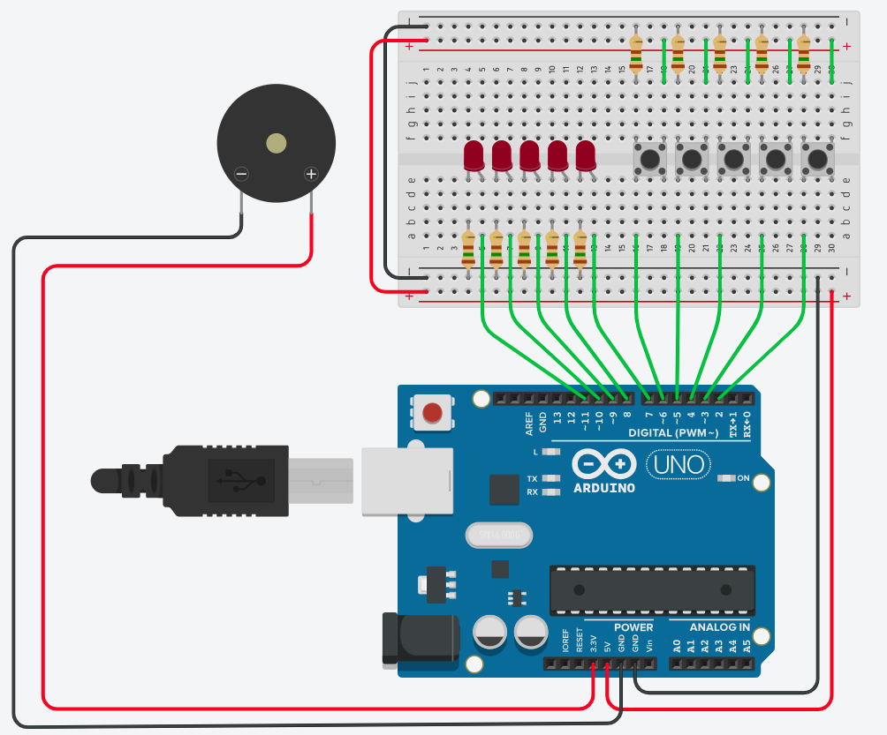

# Genius
Trabalho 2 da matéria "SSC0180 Eletronica para Computacao", criação de um jogo da memória utilizando arduino.

## Especificações
O trabalho pede que os alunos façam algum projeto de hardware e software com arduino ou esp32.

Nosso grupo escolheu fazer um jogo da memória baseado no jogo "Genius", na qual 4 botões estão associados e uma luz e um som cada um, então uma dessas luzes é escolhida aleatóriamente e o jogador deve apertar o botão correspondente. Em seguida outra luz é escolhida e o jogador deve apertar a primeira e a segunda, na ordem correta. Isso se repete até que jogador esqueça qual era a luz a ser apertada, ao errar o botão ocorre o fim do jogo.

## Componentes

| Quantidade | Componente             | Valor R$            | Função                                                         |
| ---------- | ---------------------- | ------------------- | -------------------------------------------------------------- |
| 1          | Arduino Leonardo       | Em torno de R$70,00 | Placa com microcontrolador e interpretador                     |
| 1          | Buzzer passivo         | R$12,00             | Produz sons em uma data frequência                             |
| 5          | Chave Tátil de 4 pinos | R$1,00              | Funciona como um botão                                         |
| 1          | LED 5mm Vermelho       | R$2,00              | Brilha quando recebe energia                                   |
| 1          | LED 5mm Amarelo        | R$1,50              | Brilha quando recebe energia                                   |
| 1          | LED 5mm Branco         | R$1,40              | Brilha quando recebe energia                                   |
| 1          | LED 5mm Verde          | R$1,50              | Brilha quando recebe energia                                   |
| 1          | LED 5mm  Azul          | R$1,50              | Brilha quando recebe energia                                   |
| 10         | Resistor 150Ω - Carvão | R$0,07              | Possui resistência determinada                                 |
| 1          | Protoboard 400 furos   | R$21,70             | Possui ligações que permite que a conexão entre os componentes |
| 22         | Jumper Macho-Macho     | R$0,70              | Liga dois pontos da protoboard                                 |
| **Total**  | R$133,70               |

Observações:
- Assim como no projeto anterior, nos casos em que era possível alguns jumpers foram substituídos por pedaços pequenos de metal para melhorar a visibilidade e preço.
- Poderia ser utilizado outros tipo de arduino.
- Houve um aumento no preço do LED vermelho em comparação com o trabalho anterior, isso se deu pois anteriormente foi utilizado um LED difuso e agora um LED cristal, apesar de não ser um uso comum para o LED cristal, que emite uma luz mais focada que não é necessária para o projeto, foi escolhido usar ele por uma questão estética e de disponibilidade, porém podem ser utilizadas LEDs difusos da mesma forma.

## Imagem do Circuito no Simulador
Para realizar os testes foi utilizado o [Tinkercad](https://www.tinkercad.com/dashboard)

Algumas observações sobre o simulador:
- No simulador foi utilizado um arduino do tipo UNO, mostrando novamente que não precisa ser o tipo especificado.
- No simulador não havia um buzzer do mesmo tipo daquele utilizado, então utilizamos um tipo genérico que teve que ser adaptado no circuito real.

## Funcionamento
O funcionamento do projeto pode ser dividido em 2 partes, uma do hardware (circuito e componentes) e uma do sofware (programa executado no microcontrolador).

### Hardware
O circuito é bem simples, basicamente é necessário saber que as placas arduino e esp32 possuem entradas onde podemos controlar o sinal, enviando ou medindo o sinal delas, elas serão usadas como input (entrada de informção) e output (saída de informação).

Primeiro ligamos as chaves, que chamaremos de botões. Eles conectam duas partes de um circuito quando são ligados, por isso ligamos uma de suas pontas no canal positivo e outra no canal negativo, além disso obviamente precisamos de um resistor nesse caminho para evitar que o sinal chegue no arduino em curto, impedindo a leitura. Ligamos então outra das saídas do botão ao arduino, por ela conseguiremos ler se o sinal é de 5V ou 0, repetimos esse processo para todos os botões.

Então podemos ligar os LEDs, a sua ligação é ainda mais simples visto que basta ligar o cátodo no canal negativo e então, novamente com um resistor no caminho, ligar o ânodo ao arduino, pois o arduino é capaz de emitir o sinal que acende o LED.

Com essas ligações, basta fazer com que o microcontrolador do arduino controle esses sinais de forma conveniente.

### Software
Utilizando o programa suportado pelo microcontrolador escrevemos um código em linguagem C++ que realiza as ações para o jogo:

## Projeto Funcionando

